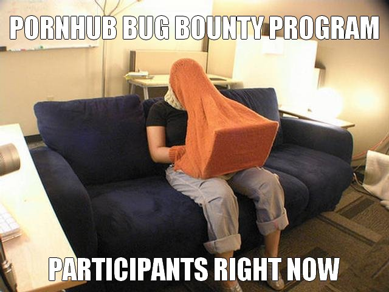
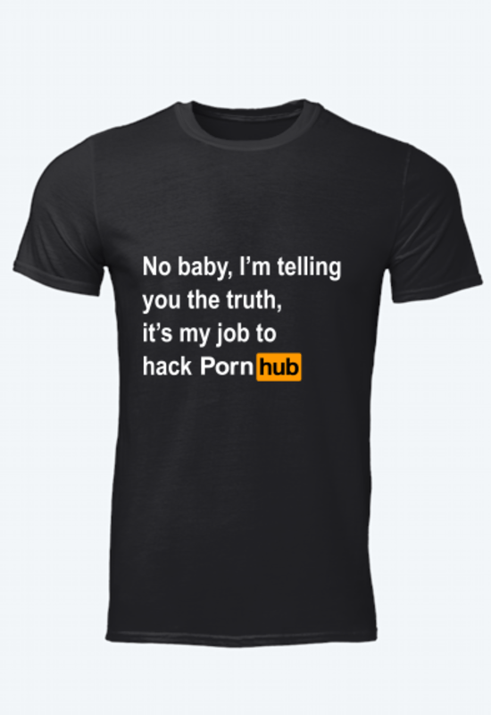
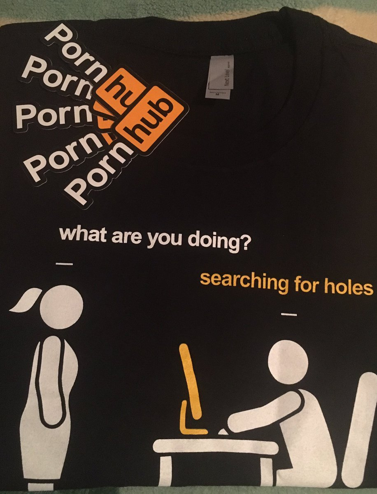
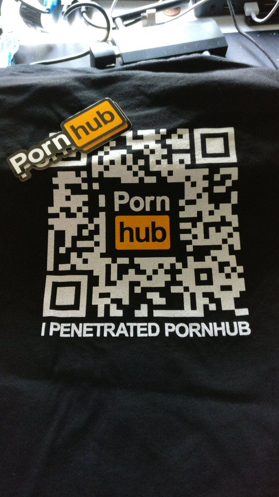

# How to hack the box

---

# whoami

----

Gianpaulo M. Soares

---

# O que é?

---

# Por que?

----

## 1. CTF (Capture The Flag)

* [Sobre o CTF (Inglês)](https://www.youtube.com/watch?v=8ev9ZX9J45A)

----

## 2. Bug bounties

* [Bug Crowd](https://www.bugcrowd.com/bug-bounty-list/)

----

[Hackerone](https://hackerone.com)

----

[Hackerone Github](https://hackerone.com/github)

----

[Hackerone Pornhub](https://hackerone.com/pornhub)

----

----

----

----

---

# Onde começar?

* nmap, curl, dig, nc, etc.
* [Kali Linux](https://kali.org)
* [/r/hackthebox](https://reddit.com/r/hackthebox)
* [owasp  cheat sheet(Open Web Application Security Project)](https://www.owasp.org/index.php/OWASP_Cheat_Sheet_Series)
* [metasploit](https://metasploit.com)

---

# Como praticar?
## (Sem ser preso)

* [hackthebox.eu](https://hackthebox.eu)
* [Garoa Hacker Clube](https://garoa.net.br/wiki/Capture_The_Flag)

---

# Eventos

* h2hc (Outubro 2019)
* roadsec (São Paulo - Novembro 2019 | Campinas - Abril 2019)
* bsides (Maio 2019)
* ysts (Mail 2019)

---

# Obrigado
